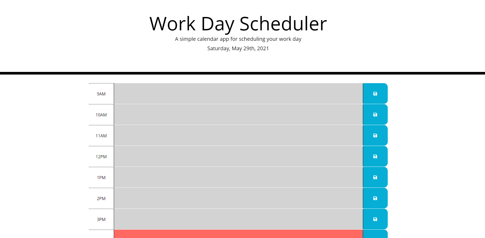

# Work-Day-Scheduler

## Link to the project 
https://samz1n.github.io/Work-Day-Scheduler/

## Goals for this Project
* Current time and day is displayed at the top of planner.
* Timeblocks for standard business hours (9-5) are displayed. (6pm was added for my family who work extended hours and I wanted the option to allow them to use my application)
* Timeblocks are colored for past present and future.
* When save is clicked the text is saved in local storage for that event,
* When page is refreshed the text and content remains.
 
